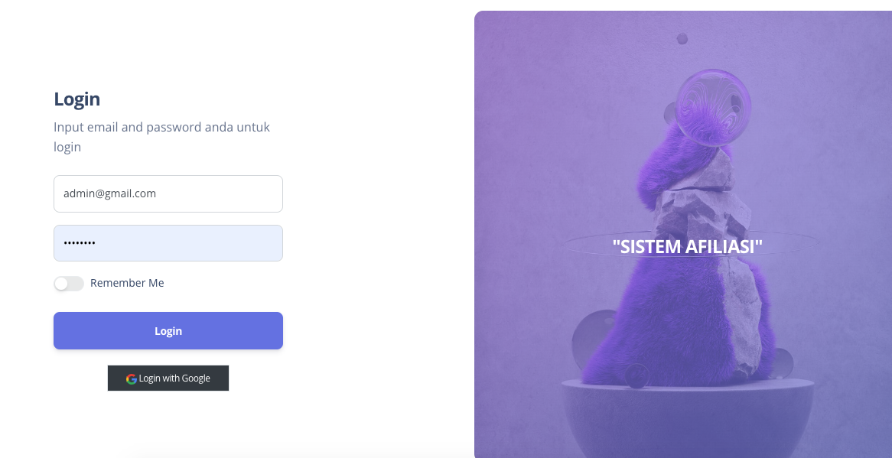
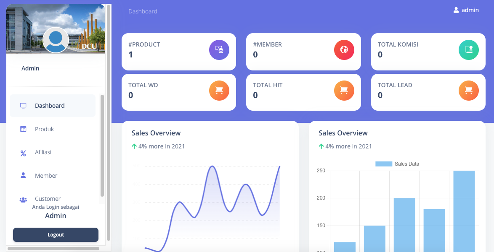
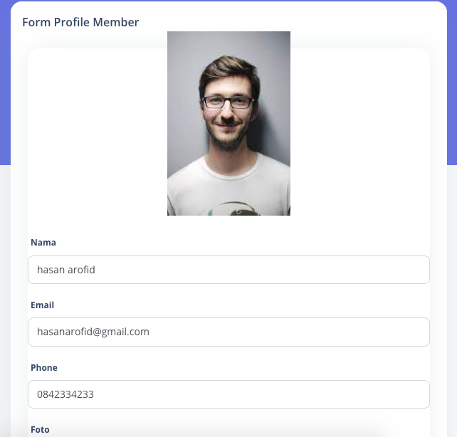

# Sistem
project Sistem Afiliasi

## Sistem   Sistem Afiliasi

### Installation
1. Clone the repository using the command "git clone [link]"
2. Create database in MySql
3. Configure the .env file accordingly
4. Run command 

```
$composer install
$php artisan migrate
$php artisan db:seed
$php artisan serve
$php artisan storage:link
```
### Mendapat Update kodingan terbaru
```
$ git fetch origin master
$ git pull origin master
```
### Kirim perubahan coding di local
```
$ git add .
$ git commit -m "catatan perubahan"
$ git push -u origin master
```

### Built With
* Bootstrap- CSS framework
* JQuery- Javascript framework
* Laravel - PHP framework
* MySql- Databse

### Progress fitur 20/8/2023

## login 5 role
* Admin (done)
* Superadmin (done)
* Member (done)
* Customer 


## halaman demo

* demo





## Rencana pengembanagan

## Akses Admin
* Menejemen Produk (done)
* Menejemen Member
* dasboard
* leads

## Akses Member
* Register Member
* membuat produk link
* menu my money
* dasboard

## Akses Customuer:
* Pilih produk afiliasi
* isi form
* melakukan pembayaran